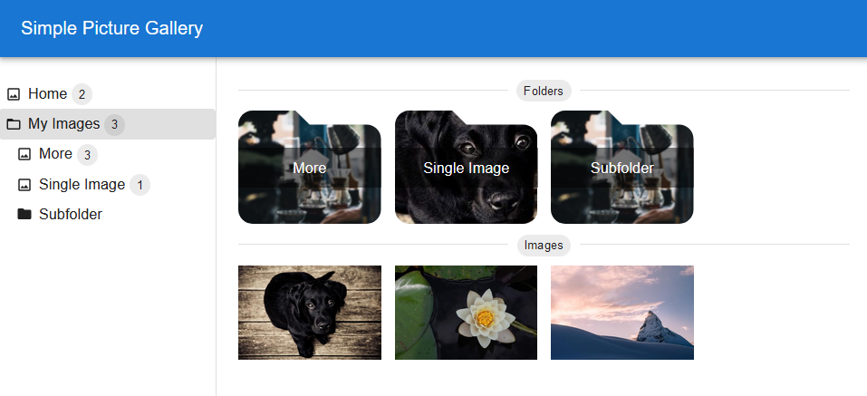
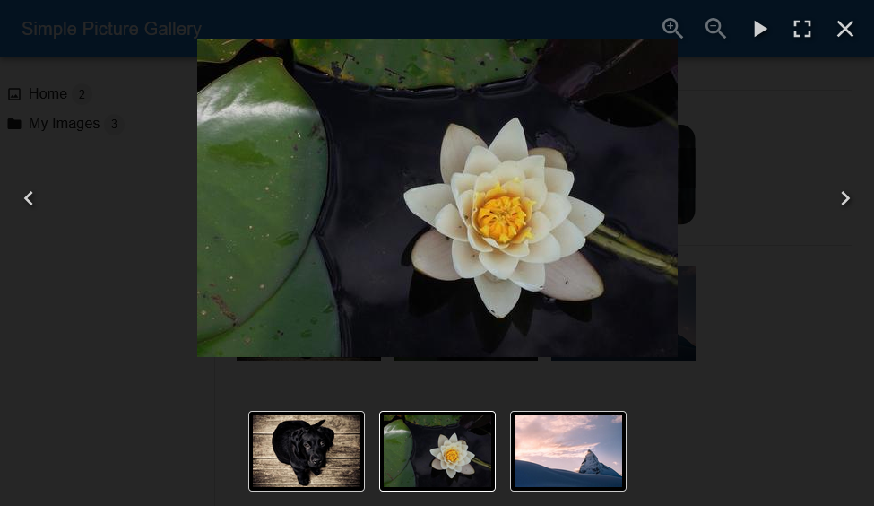
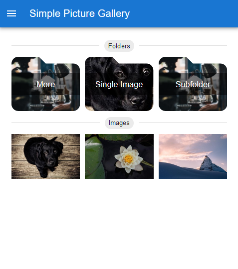
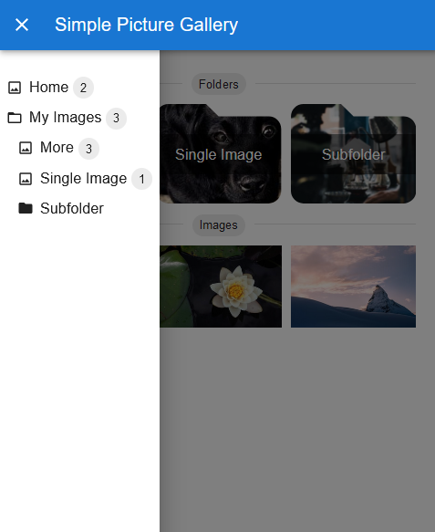
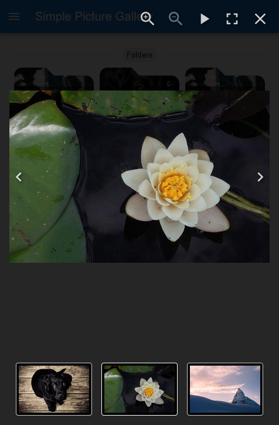

# Simple Picture Gallery

A simple picture gallery. No database required. Photos can simply be stored in your file system. Add and remove photos. Simple picture gallery will automatically show them and create thumbnails.

All you need is your photos and [docker](https://www.docker.com/).

Simple Picture Gallery is a modern looking web app due to [Material UI](https://mui.com/material-ui/), [React Photo Album](https://react-photo-album.com/) and [Yet Another React Lightbox](https://yet-another-react-lightbox.com/).

## Screenshots

### Desktop





### Mobile







## Getting Started

### Information

Folders should only contain images and other folders. Folders should not contain any other files.

### Docker

An easy way to run simple picture gallery is with docker.

```shell
docker pull docker pull ghcr.io/t-h-e/simple-picture-gallery:latest
docker run -p 3005:3001 -v /mnt/path/to/pictures:/usr/src/app/public --name my-picture-gallery ghcr.io/t-h-e/simple-picture-gallery:latest
```

#### Customization

Create an environment file `.env` containing any of the following properties to customize your gallery. All properties are optional. 

```properties
VITE_TITLE=My Gallery
VITE_APPBAR_COLOR=#F8AB2D
VITE_FAVICON_HREF=<URL to your favicon>
```

And run docker with `--env-file .env`

```shell
docker run -p 3005:3001 -v /mnt/path/to/pictures:/usr/src/app/public --env-file .env --name my-picture-gallery ghcr.io/t-h-e/simple-picture-gallery:latest
```

### Docker Compose

Even easier to run it using docker compose. 

```dockerfile
services:
  gallery:
    image: ghcr.io/t-h-e/simple-picture-gallery:latest
    container_name: my-picture-gallery
    environment:
      # customize your gallery
      - VITE_TITLE=My Gallery
      - VITE_APPBAR_COLOR=#F8AB2D
    restart: always
    volumes:
      - /mnt/path/to/pictures/:/usr/src/app/public
    ports:
      - "3005:3001"
```

### Hint

On first startup, the application is going to create thumbnails of all images. This can lead to heavy CPU usage. Thumbnails for images that are added after starting the application are created on the fly.

Thumbnails are stored in a folder `.thumbnail` in the mounted folder. In case you want to remove simple picture gallery at some point. Simply remove the container and delete the `.thumbnail` folder.

### Configure a cache with nginx

It is recommended to use a cache for the API calls so that not every request has to read from your file system again.

When using a cache, new images may not be available straight away as previous requests are then obviously cached. Set the cache timeout accordingly.

In case you are using nginx as reverse proxy already, here is an example config with a cache.

```nginx
http {
  proxy_cache_path /var/cache/nginx levels=1:2 keys_zone=picture_gallery_cache:10m max_size=100m inactive=60m use_temp_path=off;

  server {
    ...

    location / {
       proxy_pass http://127.0.0.1:3005;
    }

    location ~ /(images|directories|folderspreview) {
       proxy_cache picture_gallery_cache;
       # cache is valid for 60 minutes. Increase or decrease according to your needs.
       proxy_cache_valid 200 302 60m;
       proxy_cache_min_uses 1;
       proxy_pass http://127.0.0.1:3005;
    }

    server_name gallery.domain.com
    ...
  }
}
```

> **_NOTE:_**  `proxy_cache_path` and `proxy_cache` need to use the same zone.

See [nginx documentation](https://nginx.org/en/docs/http/ngx_http_proxy_module.html) for more details and parameters.

---

Photos from [Unsplash](https://unsplash.com)
